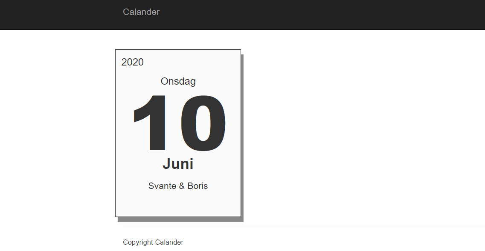

## Calander Aplication With JavaScript, CSS, JQuery, Ajax & Bootstrap.

A JavaScript course assigment.

**Application contains:**
* Calls an API for the data.
* Swedish holidays gets marked with red.

